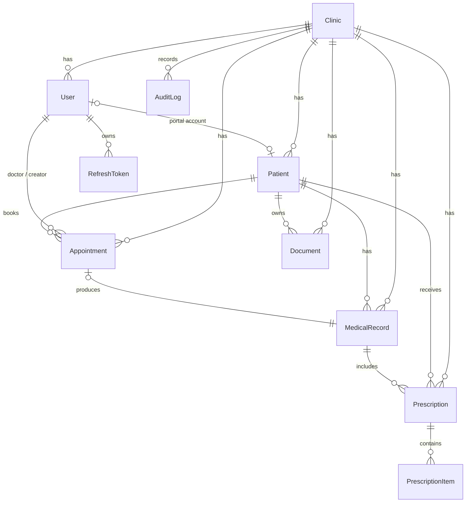

# ClinicFlow

A **multi-tenant clinic management SaaS** — a production-style demo where many independent
clinics run on one platform, each seeing only its own data. Staff register patients, book
appointments, record visits and prescriptions, and generate branded PDF documents; every
sensitive action is written to an immutable audit log.

Built as a clean, typed **React + Node.js** application with real role-based access control,
tenant isolation enforced at the service layer, JWT auth, and automated tests for the
security-critical paths.

> **Portfolio / demo project.** ClinicFlow is a personal showcase built to demonstrate
> full-stack architecture, multi-tenancy and security patterns. It is **not** a certified
> medical product and makes **no HIPAA/regulatory compliance claim**. Do not use it with real
> patient data.

---

## Highlights

- **True multi-tenancy** — every clinical row is scoped to a `clinicId` that is derived from
  the authenticated user, never from the client. Cross-tenant access is blocked and tested.
- **Five roles, real RBAC** — `SUPER_ADMIN`, `CLINIC_ADMIN`, `DOCTOR`, `STAFF`, `PATIENT`,
  enforced by middleware on every route.
- **Clinical core** — patients, appointments (with a validated status lifecycle), medical
  records, and prescriptions with line items.
- **Branded PDF documents** — server-rendered prescription / report PDFs from an HTML template
  engine, per-clinic branding, stored and re-downloadable.
- **Audit logging** — who did what, to which record, when.
- **Secure by default** — hashed passwords, short-lived JWT access + rotating refresh tokens,
  Zod validation, Helmet, CORS, and rate-limiting.
- **Tested & CI-checked** — Vitest + Supertest cover auth, RBAC and tenant-isolation; GitHub
  Actions type-checks, builds and runs the suite on every push.

## Tech stack

| Layer     | Tech |
|-----------|------|
| Frontend  | React, TypeScript, Vite, React Router, TanStack Query, Tailwind CSS |
| Backend   | Node.js, TypeScript, Express, Zod, Helmet, express-rate-limit |
| Data      | PostgreSQL, Prisma ORM |
| Auth      | JWT (access + rotating refresh), bcrypt |
| Documents | Puppeteer (HTML template → PDF) |
| Testing   | Vitest, Supertest |
| Dev / CI  | Docker Compose (Postgres), GitHub Actions |

## Roles & permissions

| Capability                         | SUPER_ADMIN | CLINIC_ADMIN | DOCTOR | STAFF | PATIENT |
|------------------------------------|:-----------:|:------------:|:------:|:-----:|:-------:|
| Manage clinics (create / suspend)  | ✅ | — | — | — | — |
| Manage clinic users                | ✅ | ✅ (own clinic) | — | — | — |
| Register / edit patients           | ✅ | ✅ | ✅ | ✅ | — |
| Book / reschedule appointments     | ✅ | ✅ | ✅ | ✅ | request only |
| Write medical records              | — | — | ✅ | — | — |
| Issue prescriptions                | — | — | ✅ | — | — |
| Generate PDF documents             | ✅ | ✅ | ✅ | ✅ | own only |
| View own records                   | — | — | — | — | ✅ |
| View audit log                     | ✅ | ✅ (own clinic) | — | — | — |

## Architecture

```
React (Vite) ── HTTPS/JSON ──▶ Express API
  routes → controllers → services → Prisma → PostgreSQL
                    │
       middleware:  authenticate (JWT) → resolve tenant → authorize (RBAC)
                  → validate (Zod) → rate-limit → error handler → audit log
```

Business logic lives in **services**, not route handlers. Every service receives the caller's
`clinicId` and `role` and filters all queries by tenant — the database is never queried without
a tenant scope (except by `SUPER_ADMIN`).

## Data model (ERD)



## API modules

| Module         | Routes (prefix) | Notes |
|----------------|-----------------|-------|
| Auth           | `/api/auth`     | register, login, refresh, logout, me |
| Clinics        | `/api/clinics`  | SUPER_ADMIN platform management |
| Users          | `/api/users`    | clinic staff/doctor management |
| Patients       | `/api/patients` | registration, search, profile |
| Appointments   | `/api/appointments` | booking + status transitions |
| Records        | `/api/records`  | encounters / medical records |
| Prescriptions  | `/api/prescriptions` | prescriptions + items |
| Documents      | `/api/documents` | generate + download PDFs |
| Audit          | `/api/audit`    | read-only audit trail |

Full request/response contracts live in [`docs/API.md`](docs/API.md) (added during Phase 9).

## Getting started

```bash
# 1. Start PostgreSQL
docker compose up -d

# 2. Backend
cd server
cp .env.example .env          # set JWT secrets: openssl rand -hex 32
npm install
npx prisma migrate dev
npm run db:seed               # demo clinics, users, patients
npm run dev                   # http://localhost:4000

# 3. Frontend (added in Phase 10)
cd ../client
npm install
npm run dev                   # http://localhost:5173
```

### Demo credentials

Populated by the seed script — see [`docs/DEMO.md`](docs/DEMO.md) once Phase 4 lands.

## Testing

```bash
cd server
npm test        # unit + API + RBAC + tenant-isolation
```

Security-critical scenarios (cross-tenant read/write, privilege escalation, invalid state
transitions) are tested first and must stay green.

## Security notes

See [`docs/SECURITY.md`](docs/SECURITY.md) for the full checklist. In short: no secrets in the
repo, parameterised queries via Prisma, hashed passwords, tokenised sessions, validated input,
least-privilege RBAC, and errors that never leak internals.

## Roadmap / limitations

- Notifications and billing are out of scope for v1.
- PDF generation uses headless Chromium (Puppeteer) — heavier but pixel-accurate.
- Not a regulated medical device; demo data only.

## Build phases

- [x] **P1** Project setup
- [x] **P2** Database architecture (Prisma schema)
- [x] **P3** Migrations
- [x] **P4** Seed / demo data
- [x] **P5** Backend foundation (app, config, middleware, error handling)
- [x] **P6** Authentication (JWT access + refresh)
- [x] **P7** RBAC
- [x] **P8** Multi-tenancy enforcement
- [x] **P9** Backend modules / APIs — auth, patients, appointments, records, prescriptions, documents
- [x] **P10** Frontend foundation (Vite + React + TS + Tailwind, auth, protected routes, API client with auto token-refresh)
- [x] **P11** Frontend modules — dashboard, patients, appointments, prescriptions _(records view next)_
- [x] **P12** PDF / documents (Puppeteer branded prescription PDF + PNG preview)
- [ ] **P13** Testing
- [ ] **P14** Security review
- [ ] **P15** Performance review
- [ ] **P16** UI/UX polish
- [ ] **P17** README / GitHub prep
- [ ] **P18** Final end-to-end QA

## License

[MIT](LICENSE)
